# 16 — Proposed Site Architecture

**Researched:** 2026-07-31 · **Machine-readable:** `data/url-map.csv`

---

## Principle

**216 URLs → ~34 core URLs + 5 tools.** Every page must represent a distinct user intent or a useful entity. Nothing is deleted; everything consolidated is redirected.

The current architecture is not badly *built* — the registry pattern is genuinely good. It is badly *scoped*: eleven page types, each expanded to fill its own shape, producing twenty URLs for one intent.

---

## Proposed sitemap

```mermaid
graph TD
    HOME["/ — Homepage<br/>Missed calls, late quotes — handled"]

    HOME --> REC["/ai-receptionist-for-contractors<br/>PRIMARY MONEY PAGE"]
    HOME --> MISS["/missed-calls<br/>NEW pillar"]
    HOME --> QUOTE["/quote-follow-up<br/>NEW pillar"]
    HOME --> SYS["/ai-business-system<br/>flagship build"]
    HOME --> OWN["/what-you-own<br/>NEW — the moat"]
    HOME --> PRICE["/pricing"]
    HOME --> TOOLS["/tools — free tools hub"]
    HOME --> PROOF["/proof<br/>NEW — case studies"]
    HOME --> ABOUT["/about — named founder"]
    HOME --> CREATE["/create — fit check"]

    REC --> BEYOND["/beyond-platform-ai<br/>NEW — 'you already have Jobber AI'"]
    REC --> VS["/compare/ai-receptionist-vs-answering-service"]

    MISS --> T1["/tools/missed-call-revenue-calculator"]
    QUOTE --> T2["/tools/contractor-quote-follow-up-generator"]
    TOOLS --> T1
    TOOLS --> T2
    TOOLS --> T3["/tools/contractor-lead-leak-audit"]
    TOOLS --> T4["/tools/contractor-profit-pricing-calculator"]
    TOOLS --> T5["/tools/contractor-labor-burden-calculator"]

    HOME --> TRADES["/trades — hub"]
    TRADES --> TR1["/trades/fencing-decks"]
    TRADES --> TR2["/trades/landscaping"]
    TRADES --> TR3["/trades/hvac"]
    TRADES --> TR4["/trades/plumbing"]

    HOME --> INT["/integrations — hub"]
    INT --> I1["/integrations/jobber"]
    INT --> I2["/integrations/housecall-pro"]
    INT --> I3["/integrations/quickbooks"]

    HOME --> TRUST["/trust — hub"]
    TRUST --> TR_A["/trust/call-recording — PIPEDA + CASL"]
    TRUST --> TR_B["/trust/how-it-fails — escalation, honestly"]
    TRUST --> TR_C["/privacy"]
    TRUST --> TR_D["/terms"]

    HOME --> LOCAL["/locations — hub, gated on proof"]
    LOCAL --> L1["/locations/surrey<br/>only with a real local client"]

    HOME --> LEARN["/resources — trimmed hub"]
    LEARN --> R1["/resources/what-is-an-ai-receptionist"]
    LEARN --> R2["/resources/ai-automation-examples-for-small-business"]
    LEARN --> R3["/resources/best-ai-tools-for-contractors"]

    style OWN fill:#7c2d12,color:#fff
    style BEYOND fill:#7c2d12,color:#fff
    style PROOF fill:#7c2d12,color:#fff
    style QUOTE fill:#7c2d12,color:#fff
    style MISS fill:#7c2d12,color:#fff
```

*(Highlighted nodes are new and carry the differentiation.)*

---

## Page specifications

| URL | Type | Primary keyword | Funnel | CTA | Proof needed | Schema | Status |
|---|---|---|---|---|---|---|---|
| `/` | Home | brand + problem | All | Fit check | **Recording + 1 client** | Organization, LocalBusiness | Rewrite |
| `/ai-receptionist-for-contractors` | Money | AI receptionist for contractors | MOF/BOF | Get build | **Recording** | Service, FAQPage | Keep + rewrite |
| `/missed-calls` | Pillar | missed calls contractors | TOF/MOF | Calculator | Honest stats | Article, FAQPage | **New** |
| `/quote-follow-up` | Pillar | estimate follow up contractors | TOF/MOF | Generator | Benchmark | Article, FAQPage | **New** |
| `/what-you-own` | Trust | AI agency vendor lock-in | MOF/BOF | Fit check | Contract terms | Article, FAQPage | **New** |
| `/beyond-platform-ai` | Money | Jobber AI receptionist limitations | BOF | Fit check | Integration screenshot | Article | **New** |
| `/ai-business-system` | Money | connected AI system small business | BOF | Fit check | Case study | Service, Offer | Keep + **fix pricing** |
| `/pricing` | Money | AI receptionist cost | BOF | Fit check | — | Offer | Keep + absorb 7 cost pages |
| `/proof` | Trust | — | All | Fit check | **Blocked on 1 client** | — | **New — gated** |
| `/about` | Entity | — | All | — | Founder identity | **Person** | Rewrite |
| `/create` | Conversion | — | BOF | — | — | — | Keep |
| `/tools` + 5 tools | Tool | per tool | TOF | Email → build | — | **WebApplication** | Keep + promote |
| `/trades/*` (4) | Industry | <trade> office automation | MOF | Fit check | **1 client each** | Service | New, gated |
| `/integrations/*` (3) | Integration | Jobber integration | MOF/BOF | Fit check | **Screenshot** | Service | New, gated |
| `/trust/call-recording` | Trust | call recording consent Canada | MOF | — | Legal review | Article | **New** |
| `/trust/how-it-fails` | Trust | AI receptionist escalation | MOF | — | Real escalation flow | Article | **New** |
| `/compare/ai-receptionist-vs-answering-service` | Compare | — | MOF | Fit check | Price table | Article | Keep |
| `/resources/*` (3) | Resource | — | TOF | Tools | — | Article | Keep 3 of 24 |
| `/locations/surrey` | Local | AI automation Surrey | MOF | Fit check | **1 local client + GBP** | LocalBusiness | Gated |

**Total: ~34 core URLs + 5 tools.**

---

## Redirect map (summary — full rows in `data/url-map.csv`)

| Source group | Count | Destination |
|---|---:|---|
| Receptionist variants | 9 | `/ai-receptionist-for-contractors` |
| Receptionist explainers | 2 | `/ai-receptionist` → `/resources/what-is-an-ai-receptionist` |
| All cost pages | 7 | `/pricing` |
| Chatbot variants | 4 | `/ai-chatbot-development` |
| Follow-up variants | 5 | `/quote-follow-up` |
| Missed-call variants | 2 | `/missed-calls` |
| Generic automation synonyms | 3 | `/ai-automation-agency` → `/ai-business-system` |
| Industries → 4 trades | 35 | `/trades/*` nearest match, else `/trades` |
| Use-cases | 25 | nearest pillar |
| How-to | 9 | nearest pillar |
| Compare | 20 | `/compare/ai-receptionist-vs-answering-service` or `/pricing` |
| Resources | 21 | nearest pillar |
| Locations | 18 | `/locations` hub |
| Creators | 20 | **`noindex`, not redirected** — pending the audience decision |
| Solutions / shop / use-cases hubs | 3 | `/services` or `/tools` |

**Rules:**
1. **301/308 permanent.** Nothing deleted.
2. **No chains.** Every source points directly at its final destination.
3. **GSC baseline captured first** — non-negotiable (`18-implementation-roadmap.md` Stage 0).
4. **`/creators` gets `noindex`, not a redirect** — redirecting 20 creator pages into a contractor funnel is a bad user experience and a bad relevance signal. If the vertical is revived or spun out, `noindex` is reversible; a redirect is messier to undo.
5. **Staged over 4 weeks**, highest-cannibalization clusters first, monitoring between stages.

---

## What this architecture fixes

| Problem today | After |
|---|---|
| 20 URLs on one intent | 3 |
| 7 cost pages | 1 |
| 39 industries, zero delivered work | 4, each with a client |
| 19 city pages, no GBP | 1, gated on proof |
| Tools orphaned from funnel | Tools anchor two pillars |
| No ownership content | `/what-you-own` — the moat |
| No proof surface | `/proof` exists and gates the rest |
| Entity unresolvable | One name, one audience, 4–6 industries |

## What it cannot fix

Architecture does not create evidence. **`/proof` is an empty page until there is a client**, and every gated item above stays gated until then. This structure is designed to make the proof problem *visible* rather than to paper over it with volume — which is what the current 216-page structure does.
