# 06 — Revised Architecture

**Status: PROPOSED. No redirect is active. No URL was deleted or altered.**

---

## 1. What changed from the Phase-1 architecture

Phase 1 proposed **216 → ~34 core URLs**, executed via 152 merges.

The measured evidence does not support that, for three reasons:

1. **Google has already consolidated.** Both receptionist queries tested return exactly one URL. There is no signal-splitting to fix.
2. **The plan would have redirected away the site's best assets** — `/ai-receptionist` (146 impressions, serves the flagship query) and `/locations/ai-chatbot-developer-vancouver` (outranks its money page by 25 positions).
3. **137 of 216 URLs have no data at all.** Merging on absence-of-data is not a decision, it is a guess.

**Revised approach: additive, not subtractive.** Build the three pages that address *unrepresented* demand, protect what measurably works, and defer consolidation until 90–180 days of data exist.

## 2. Proposed sitemap

```mermaid
graph TD
    HOME["/ — Homepage<br/>3 clicks · pos 15.4 · PROTECTED"]

    HOME --> REC["/ai-receptionist<br/>146 impr · serves flagship query<br/>PROTECTED — canonical TBD"]
    HOME --> RECC["/ai-receptionist-for-contractors<br/>16 impr · does NOT rank for own query<br/>canonical decision → owner"]
    HOME --> CHAT["/ai-chatbot-development<br/>118 impr · PROTECTED"]
    HOME --> SYS["/ai-business-system<br/>pos 4.5 · P0 pricing FIXED"]
    HOME --> IND["/industries<br/>1 click · pos 5.8 · PROTECTED"]
    HOME --> TOOLS["/tools — 5 free tools<br/>0 impr · only 13 days live · PROTECTED"]
    HOME --> PRICE["/pricing · PROTECTED"]
    HOME --> CREATE["/create — pos 4.5 · PROTECTED"]

    HOME --> NEW1["/quote-follow-up<br/>NEW — 25 impr of unassisted demand<br/>no page exists today"]
    HOME --> NEW2["/what-you-own<br/>NEW — 0 queries, 0 pages<br/>UNTESTED, strategic bet"]
    HOME --> NEW3["/beyond-platform-ai<br/>NEW — 0 Jobber queries<br/>UNTESTED, strategic bet"]

    IND --> LAND["/industries/landscaping-ai-automation<br/>15 impr · pos 55.2 · best industry page"]
    IND --> IND2["34 other industry pages<br/>DEFER — no data"]

    HOME --> LOC["/locations — BC only"]
    LOC --> LOC1["/locations/ai-chatbot-developer-vancouver<br/>pos 52.0 — OUTRANKS its money page<br/>PROTECTED"]
    LOC --> LOC2["6 further BC pages with impressions<br/>DEFER — do NOT noindex"]
    LOC --> LOC3["Calgary · Edmonton · Toronto<br/>NOINDEX PROPOSED — out of service area"]

    HOME --> RES["/resources"]
    RES --> RES1["/resources/best-ai-tools-for-contractors<br/>66 impr · PROTECTED"]
    RES --> RES2["/resources/is-ai-receptionist-worth-it<br/>25 impr · pos 42.4 · PROTECTED"]

    HOME --> ORPH["/demo (pos 3.7) · /creators (pos 8.0)<br/>INDEXED BUT NOT IN SITEMAP — investigate"]

    style NEW1 fill:#7c2d12,color:#fff
    style NEW2 fill:#7c2d12,color:#fff
    style NEW3 fill:#7c2d12,color:#fff
    style LOC3 fill:#78350f,color:#fff
    style ORPH fill:#1e3a5f,color:#fff
```

## 3. The three new pages — and their honest evidence status

| Page | Measured support | Status |
|---|---|---|
| **`/quote-follow-up`** | **25 impressions across 10 distinct queries**, arriving with no page targeting the intent. Incidental capture. | **Weakly supported by measurement.** Best-evidenced of the three. |
| **`/what-you-own`** | **Zero queries. Zero pages.** No search demand measured for ownership/lock-in language. | **Untested strategic bet.** Justified by competitor analysis (`research/07-competitor-analysis.md`), not by GSC. Say so plainly. |
| **`/beyond-platform-ai`** | **Zero Jobber/Housecall queries.** No page exists. | **Untested strategic bet.** Same. |

**These are the only three pages recommended for creation**, and two of the three are explicitly bets rather than evidence-led. That distinction must survive into the build decision — do not let "recommended" blur into "validated."

## 4. Redirect plan — proposed, not activated

**Zero redirects are proposed for immediate execution.**

The Phase-1 redirect map (`research/data/url-map.csv`, 152 merges) is **suspended**, not cancelled. It should be re-derived after:

1. 90 days of additional GSC data (target: ~2026-10-29)
2. Query×page joins for the top 20 queries (≈20 page loads, converts `04` from partial to substantial)
3. A backlink pull, so "preserve URLs with links" can actually be evaluated
4. The canonical decision in `07-owner-decisions.md` §1

**The single reversible action proposed now:** `noindex` on 3 out-of-service-area location pages (Calgary, Edmonton, Toronto).

## 5. Canada vs United States

Keep separate **only where evidence justifies it** — the assignment's rule.

Measured: **Canada 302 impressions / 3 clicks · US 193 impressions / 0 clicks.** The US is 31.7% of impressions with zero pages built for it.

| Element | Decision |
|---|---|
| CAD pricing stated explicitly | **Keep separate** — genuine regulatory/currency difference |
| PIPEDA / CASL content | **Keep separate** — genuinely different law |
| BC location pages | **Keep** — measured performance |
| US state pages | **Do not build.** No evidence, no proof, no presence |
| Hamilton ON / Alberta demand | **Remote-delivery content only**, routed to `/remote-ai-development`. Never a local-service page |

## 6. What is explicitly NOT changing

- **`robots.txt`** — untouched. No technical defect found; the AI-crawler allowlist is a genuine asset.
- **The registry architecture** (`lib/data/*.ts` → `registry.ts` → sitemap + llms.txt) — untouched and preserved.
- **All five free tools** — untouched, protected, re-measure at 90 days.
- **Sitemap** — unchanged at 216 URLs.
- **Every existing URL** — nothing deleted, nothing redirected.

## 7. Honest assessment

This revised architecture is **much less ambitious than Phase 1's**, and that is the correct outcome of running an evidence gate. The measured data said the diagnosis was partly wrong and the dataset too thin to act on — so the plan shrank from "restructure 152 URLs" to "build 3 pages, protect 21, noindex 3, defer the rest."

The deeper finding stands unchanged and is now measured rather than inferred: **at 3 clicks and average position 63.9, search is not currently an acquisition channel for this business.** Architecture is not the lever. Proof is — which is why `08-design-partner-plan.md` matters more than this file.
